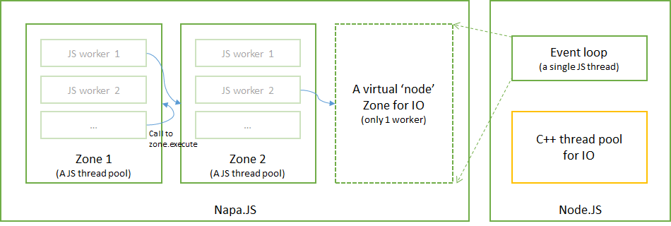

# Napa.JS
Napa.JS is a multi-threaded JavaScript runtime built on V8 and TypeScript, which was originally designed to develop highly iterative services with non-compromised performance in Bing. As it evolves, we find it useful to complement Node.JS in CPU-bound tasks, with the capability of executing JavaScript in multiple V8 isolates and communicating between them. Napa.JS is exposed as a Node.JS module, while it can also be embedded in a host process without Node.JS dependency.

## Installation
```
npm install napajs
```
## Quick Start
```ts
let napa = require('napajs');
let zone = napa.zone.create('zone1');

// Execute an anonymous function in any worker thread in 'zone1'.
zone.execute(
    (text: string) => {
        return text;
    }, 
    ['hello world'])
    .then((result: napa.zone.Result) => {
        console.log(result.value);
    });
```
## Features
- Multi-threaded JavaScript runtime
- Node.JS compatible module architecture with NPM support
- API for object transportation, object sharing and synchronization across JavaScript threads
- API for pluggable logging, metric and memory allocator
- Distributed as a Node.JS module, as well as supporting embed scenarios

## Architecture
In Napa.JS, all works related to multi-threading are around the concept of `Zone`,
which is the basic unit to define policies and execute JavaScript code. 
A process may contain multiple zones, each consists of multiple JavaScript `Workers`. 



Within a zone, all workers are symmetrical: they load the same code, serve `zone.broadcast` and `zone.execute` in an indistinguishable way. Basically, you cannot ask a zone to execute code on a specific worker. 

Workers across different zones are asymmetrical: they may load different code, or load the same code but reinforce different policies, like heap size, security settings, etc. Applications may need multiple zones for work loads of different purposes or different policies.

Napa.JS provides API to access current or other zones in JavaScript, thus a parallelizable workflow can be easily described by `zone.execute` across workers or zones. Node.JS event loop is exposed as a single-worker 'virtual' zone. Thus code running in Napa.JS isolates can call to Node.JS world via `zone.node.execute`.

## Documentation
- [API reference](docs/api/index.md)
- [Modules](docs/api/module.md)
- [Benchmarks](benchmark/README.md)
- [Embedder's guide](docs/embedder/index.md)
- [Design docs](docs/design/index.md)

## Contribute

